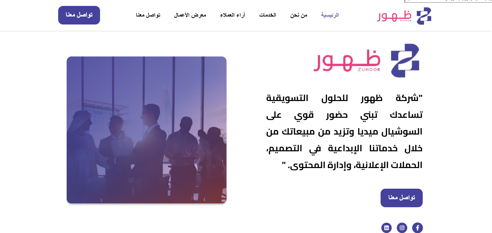
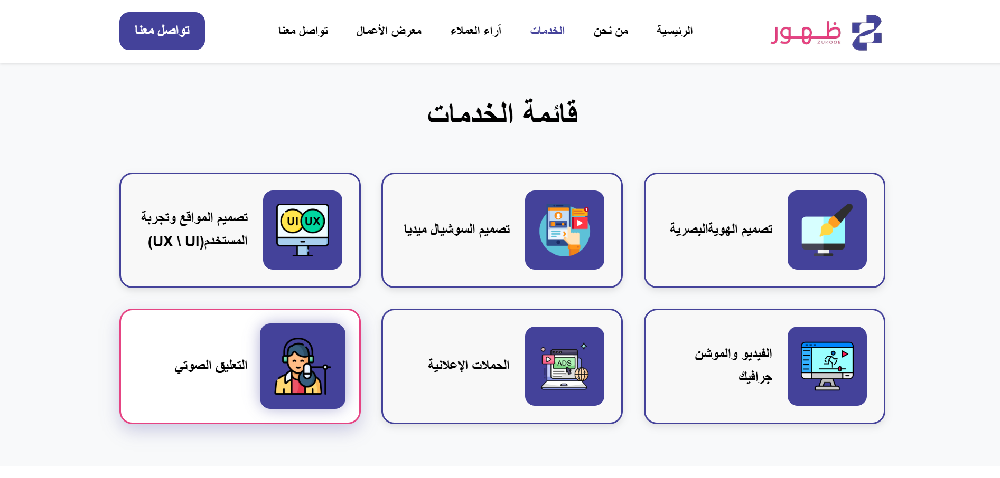

# 🌸 Zuhour Website

A modern and fully responsive website designed and developed for **Zuhour Company** 🌸  
Developed by **Farah Waseem Skaik** 💻

---

## 🔗 Live Demo
🌐 [Click here to view the live website](https://farahwaseem.github.io/zuhoor-website/)

---

## ✨ Features

- Fully responsive on all devices 📱💻  
- Smooth animations and elegant transitions  
- Customer testimonials with an interactive slider  
- Professional portfolio with image gallery  
- Contact section for direct communication  

---

## 🧩 Technologies Used

- **HTML5**  
- **CSS3**  
- **JavaScript (Vanilla)**  
- **Responsive Design Principles**  
- **GitHub Pages** for hosting 🚀  

---

## 📸 Website Preview

---

## 🛠️ How to Edit

You can easily customize the website by editing the following files:

| File | Description |
|------|--------------|
| `index.html` | Main structure and text content |
| `main.css` | Global styles, colors, and typography |
| `main.js` | Animations and interactive functions |
| `assets/images/` | Folder containing all images used |

---

## 👩‍💻 Developer

Designed & coded with ❤️ by **Farah Waseem Skaik**  
📧 [farahws2003@gmail.com](mailto:farahws2003@gmail.com)
